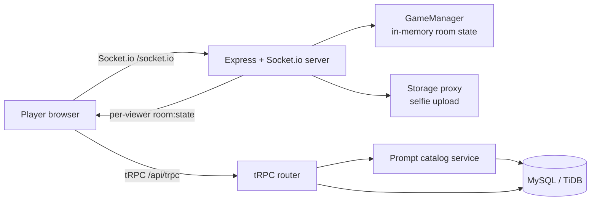

# Ego & ID Game — Developer Handover

**Repository:** [github.com/nathanmcgurl/ego-and-id](https://github.com/nathanmcgurl/ego-and-id)  
**Project directory:** `/home/ubuntu/ego-id-game-service`  
**Current saved application checkpoint:** `c8a9328e`  
**Handover date:** 11 August 2026  
**Document purpose:** Provide sufficient technical, product, and operational context for a developer to take ownership of future development.

> **Important repository note.** The GitHub repository currently contains `ego-id-game-backup.tar.gz`, a clean source archive, rather than an exploded source tree. Download and extract it before beginning development. The archive excludes environment secrets, build output, `node_modules`, and prior `.git` metadata.

---

## 1. Product Summary

**Ego & ID** is a browser-based, real-time, multiplayer party game for 3–11 players. A rotating Judge privately selects one prompt from ten choices, ranks players against that secret prompt, and other players infer the prompt from the revealed ranking. The experience is built for mobile use in a shared room and uses a deliberately vibrant Memphis-inspired visual design.

The public entry point lets someone create a room or join with a six-character room code and display name. An optional selfie can be captured during entry and displayed as a player avatar. The host controls room settings and game progression. A separate owner-only Prompt Studio manages the curated prompt catalog.

| Area | Current capability |
| --- | --- |
| Multiplayer transport | Socket.io over `/socket.io` |
| Authentication | Manus OAuth for owner/admin Prompt Studio access |
| Room identity | Six-character uppercase room code plus per-player session token |
| Avatars | Optional browser-camera selfie, stored through Manus storage |
| Prompt administration | Protected create, edit, delete, risk flag, and CSV-style import |
| Responsive interface | React + Tailwind, optimized for phone and desktop layouts |
| Runtime model | Single Node/Express process with an in-memory game manager |

---

## 2. First Steps for a New Developer

### 2.1 Recover the source from GitHub

The GitHub repository currently has a single source archive. After cloning, extract it into a working directory:

```bash
git clone https://github.com/nathanmcgurl/ego-and-id.git
cd ego-and-id
tar -xzf ego-id-game-backup.tar.gz
cd ego-id-game-service
```

If the extracted project is adopted as the working repository, initialise a new Git history (or replace the archive-only repository contents with the extracted files), then commit the exploded source tree. This will make code review, branching, and future deployment much more practical.

```bash
git init
git add .
git commit -m "Restore Ego & ID application source"
git branch -M main
git remote add origin https://github.com/nathanmcgurl/ego-and-id.git
git push -u origin main
```

### 2.2 Install and run

| Task | Command |
| --- | --- |
| Install dependencies | `pnpm install` |
| Start development server | `pnpm dev` |
| Type-check | `pnpm check` |
| Run unit tests | `pnpm test` |
| Build production bundle | `pnpm build` |
| Run production bundle | `pnpm start` |
| Generate and apply migrations in a local/external environment | `pnpm db:push` |

The application server starts Vite in development mode and serves the built client in production. Do **not** hardcode ports; the server reads `PORT` and selects an available port when necessary.

### 2.3 Environment and platform services

The original project ran in a Manus full-stack environment. A new environment must provide equivalent values for the following categories:

| Capability | Relevant configuration | Why it is needed |
| --- | --- | --- |
| Database | `DATABASE_URL` | Drizzle/MySQL-compatible persistence for users and prompts |
| Session security | `JWT_SECRET` | OAuth session-cookie signing |
| OAuth | `OAUTH_SERVER_URL`, `VITE_OAUTH_PORTAL_URL`, `VITE_APP_ID` | Manus authentication flow and Prompt Studio access |
| Owner identity | `OWNER_OPEN_ID`, `OWNER_NAME` | Initial admin ownership assignment |
| Storage | `BUILT_IN_FORGE_API_URL`, `BUILT_IN_FORGE_API_KEY` | Stored selfie avatars and storage proxy |
| Public runtime client | `VITE_FRONTEND_FORGE_API_URL`, `VITE_FRONTEND_FORGE_API_KEY` | Manus-provided frontend services |

No production secrets are included in the GitHub archive. Recreate secrets in the target environment rather than copying credentials from the old account.

---

## 3. Technology Architecture

### 3.1 Stack

| Layer | Technology |
| --- | --- |
| Client | React 19, TypeScript, Vite, Wouter, Tailwind CSS 4 |
| Interaction | `@dnd-kit` for pointer and keyboard ranking |
| Real-time | Socket.io 4 client and server |
| HTTP server | Express 4 on Node.js |
| Typed administration API | tRPC 11 with Zod validation |
| Database layer | Drizzle ORM with MySQL/TiDB driver |
| Auth | Manus OAuth and role-aware tRPC procedures |
| File storage | Manus storage proxy / S3-compatible service |
| Testing | Vitest plus Node and Chromium smoke scripts |

### 3.2 Runtime diagram



### 3.3 Core source map

| Path | Responsibility |
| --- | --- |
| `client/src/pages/Home.tsx` | Public landing page, create/join forms, camera capture, session save and route transition |
| `client/src/pages/GameRoom.tsx` | Live lobby, Judge screens, ranking drag-and-drop, guessing, results, leaderboard, room recovery UI |
| `client/src/pages/Admin.tsx` | Owner-only Prompt Studio and CSV import interface |
| `client/src/lib/gameSocket.ts` | Socket client, local session persistence, typed event wrappers |
| `shared/game.ts` | Shared phase, room-view, player, ranking, and Socket result types |
| `server/gameEngine.ts` | Authoritative room lifecycle, prompt privacy, ranking validation, scoring, phase transitions |
| `server/realtime.ts` | Socket.io event handlers, browser-session map, broadcast logic, selfie upload validation |
| `server/gamePrompts.ts` | Prompt catalog persistence, seeding, CRUD, and refresh into the game engine |
| `server/routers.ts` | tRPC admin endpoints for prompt management |
| `drizzle/schema.ts` | Drizzle database schema |
| `server/_core/index.ts` | Express/HTTP server startup, OAuth/storage/tRPC registration, Socket.io registration |
| `server/*.test.ts` | Vitest engine, authentication, and admin-procedure coverage |
| `socket-smoke.mjs` | Three-client Socket.io integration smoke test |
| `browser-flow-smoke.mjs` | Headless Chromium end-to-end UI smoke test |
| `verification_notes.md` | Historical QA record; useful context but not the source of truth |

---

## 4. Current Game Flow Implemented in Source

The source archive should be treated as the authoritative current behaviour. Its phases are defined in `shared/game.ts`:

```text
LOBBY
  → JUDGE_SELECT
  → JUDGE_RANK
  → GUESS_PROMPT
  → ROUND_RESULTS
  → JUDGE_SELECT (next round) or GAME_OVER
```

### 4.1 Phase behaviour and visibility

| Phase | Actor action | Data visible to Judge | Data visible to other players |
| --- | --- | --- | --- |
| `LOBBY` | Players join; each toggles ready; host starts when 3+ players are all ready | Roster and host settings | Roster and own ready control |
| `JUDGE_SELECT` | Judge selects one prompt from exactly ten candidate prompts | Ten prompt options | Waiting state; no candidate prompts |
| `JUDGE_RANK` | Judge drag-ranks the eligible player list | Rankable player IDs | Waiting state; secret prompt remains private |
| `GUESS_PROMPT` | Non-Judges choose a prompt after ranking is revealed | Ranking and waiting status | Revealed ranking plus the ten candidate prompt options |
| `ROUND_RESULTS` | Scores and secret prompt are shown; host advances | Secret prompt, ranking, score events | Same visible results |
| `GAME_OVER` | Final leaderboard | Final standings | Final standings |

### 4.2 Room, player, and session rules

* A room code contains six characters drawn from `ABCDEFGHJKLMNPQRSTUVWXYZ23456789`.
* The lobby supports a maximum of 11 players and requires at least 3 players to start.
* Display names are trimmed, normalized, case-insensitively unique within a room, and must be 2–24 characters.
* A `JoinSession` contains `roomCode`, `playerId`, and `sessionToken`. It is stored in browser `localStorage` under `ego-id-game:session`.
* Socket reconnection uses `room:resume` with that saved session. A token mismatch rejects recovery.
* A player disconnect changes `isConnected`; no player removal, room expiration, or host handoff policy is currently implemented.

### 4.3 Prompt rules

* The Judge receives exactly ten candidate prompts.
* Prompt selection is filtered by the room’s `allowRiskyPrompts` setting.
* Previously used prompts are avoided until fewer than ten unused eligible prompts remain; then the used set resets.
* At least ten eligible prompts are required for a round to start.

---

## 5. Socket.io Contract

All game mutations are server-authoritative. Clients emit an event and receive an acknowledgement shaped as either `{ ok: true, data }` or `{ ok: false, error }`. The server then broadcasts a personalized `room:state` view to every connected socket in the room.

| Direction | Event | Payload | Purpose |
| --- | --- | --- | --- |
| Client → server | `room:create` | `{ displayName, avatarDataUrl?, settings? }` | Creates room and host session |
| Client → server | `room:join` | `{ roomCode, displayName, avatarDataUrl? }` | Joins a lobby |
| Client → server | `room:resume` | `JoinSession` | Restores a saved session after reconnect |
| Client → server | `room:request-state` | none | Returns current personalized room view |
| Client → server | `lobby:set-ready` | `boolean` | Toggles readiness during the lobby |
| Client → server | `lobby:update-settings` | Partial room settings | Host-only settings update |
| Client → server | `game:start` | none | Host starts a valid lobby |
| Client → server | `game:select-prompt` | `promptId` | Current Judge selects secret prompt |
| Client → server | `game:submit-ranking` | `playerIds[]` | Current Judge locks a ranking |
| Client → server | `game:submit-guess` | `promptId` | Non-Judge locks a guess |
| Client → server | `game:reveal-results` | none | Host or Judge force-settles a guessing phase |
| Client → server | `game:advance-round` | none | Host advances from results |
| Server → client | `room:state` | `GameRoomView` | Personalized synchronized state after each accepted action |

> **Privacy rule:** `GameManager.getRoomView(roomCode, viewerPlayerId)` is the boundary that suppresses prompt options and the secret prompt from ineligible viewers. Future work should preserve this model and never rely solely on client-side hiding.

---

## 6. Scoring: Current Code vs. Latest Product Decision

This is the most important handover caveat.

### 6.1 Current behaviour in the source archive

`server/gameEngine.ts` currently implements the following scoring logic:

1. Each ranked player who guessed the secret prompt correctly receives a **ranking-position score** of `max(1, playerCount - rank + 1)`.
2. Each correct prompt guess adds **2 additional points** to that player.
3. The Judge receives **1 point for each correct non-Judge guess**.
4. If all non-Judges guess correctly, the Judge receives a **5-point Mind Meld bonus** and each correct player receives an additional **1 point**.

The current results UI also labels the ranking panel **“Rank points”** and displays per-rank points.

### 6.2 Latest agreed product rules to restore or complete

Later user-testing feedback specified a different rule set:

| Rule | Intended product behaviour |
| --- | --- |
| Player scoring | A player earns **2 points only** for correctly guessing the prompt |
| Wrong answer | **0 points** |
| Judge scoring | Judge earns **1 point for every player who guesses correctly** |
| Judge unanimous bonus | Judge earns an extra **5 points** when every eligible player guesses correctly |
| Ranking score | **No points** are awarded because a player appears in, or is positioned in, the ranking |

### 6.3 Required reconciliation before a public release

The current checkout and GitHub archive still contain the older scoring implementation. `verification_notes.md` contains later QA notes describing the newer intended behaviour, but the source has not retained all of those edits. A future developer should make the product decision explicit, then update the engine, shared types, results UI, smoke scripts, and tests together.

For the stated intended rules, remove `getRankingPoints`, the ranking loop in `settleRound`, `pointsAwarded` output, and the player-side Mind Meld bonus. Update tests to assert the exact correct/wrong/unanimous totals.

---

## 7. Other Reconciliation Items from User Testing

The following changes were agreed after initial implementation but are **not fully present in the current source archive**. Treat them as a prioritized product backlog, not as shipped behaviour.

| Item | Current source behaviour | Intended behaviour |
| --- | --- | --- |
| Invitation links | Copy button copies room code plus `/room/:code`; direct visit without a saved session shows “Room mismatch” | Copy a joinable `/?room=CODE` link and redirect direct room visitors to the prefilled join form |
| Readiness | Every player must click “I’m ready” | Players should enter the lobby already ready and wait only for host start |
| Judge in ranking | `getNonJudgePlayers()` excludes Judge | Judge’s ID should be one of the ranked IDs; Judge still does not guess |
| Ranking labels | Cards show “Player ID” beneath names | Remove this redundant subtitle |
| Results alert | Results render in place | Scroll to top and show a dismissible per-player round-points overlay/lightbox |
| Results scoring copy | “Rank points” and rank-point pills shown | Show only prompt-guess and Judge score events |

> **Rule of thumb for implementing any of these changes:** modify the shared contract first, then the authoritative engine, Socket handlers/client wrapper, React screens, tests, and smoke scripts. Do not make an interface-only change to a rule enforced on the server.

---

## 8. Data Model and Persistence

### 8.1 Tables in `drizzle/schema.ts`

| Table | Purpose | Key fields |
| --- | --- | --- |
| `users` | Manus OAuth identities and roles | `openId`, `role`, identity metadata |
| `game_prompts` | Curated prompt catalog | `id`, `text`, unique normalized `fingerprint`, `isRisky` |
| `game_rooms` | Intended room lifecycle snapshots | `roomCode`, phase, host/Judge IDs, round counters, settings/state JSON |
| `game_players` | Intended per-room player history | display name, avatar URL, role, readiness, connectivity, score |
| `game_round_entries` | Intended round-level audit data | ranking position, guessed prompt, points; nullable legacy `idText` |

### 8.2 Critical runtime limitation

Although the database schema contains room/player/round tables, **live rooms are currently held in the in-memory `GameManager.rooms` map**. The running game does not persist and rehydrate active room state through `game_rooms`, `game_players`, or `game_round_entries`.

Consequences:

* A process restart loses active rooms and session tokens.
* Multiple application instances will have separate room maps unless a shared state/adapter is introduced.
* The current implementation is suitable only for a single, always-on Node instance.

For durable production multiplayer, choose one of these approaches:

1. Persist room state transactionally in the database and hydrate/recover sessions on demand.
2. Use Redis as the real-time room/session authority and the Socket.io Redis adapter for broadcasts across instances.
3. Keep a single Reserved-hosting instance while explicitly accepting process-restart loss, then document that limitation to players.

---

## 9. Prompt Management and Administration

The Prompt Studio is available at `/admin` and uses `adminProcedure` through `server/routers.ts`. The account owner is assigned the `admin` role through the OAuth user-upsert flow.

| Operation | Constraint |
| --- | --- |
| Create / update | Prompt text is normalized and must be 5–500 characters |
| Duplicate protection | Normalized lowercase fingerprint is unique |
| Delete | Refuses if the catalog would drop to 10 prompts or fewer |
| Import | 1–200 entries per import, deduplicated by normalized text |
| Risk flag | `isRisky` is excluded unless the host enables risky prompts |
| Fallback | If no database is available or fewer than ten prompts exist, default in-code prompts are used |

The prompt catalog is loaded during server startup by `ensureGamePromptCatalog()`, which seeds the default prompts into the database when the table is empty.

---

## 10. Selfie Avatar Flow

1. The homepage can access the browser camera using `getUserMedia`.
2. A 320×320 JPEG is exported from a canvas as a data URL.
3. `room:create` or `room:join` sends the optional `avatarDataUrl` over Socket.io.
4. `server/realtime.ts` validates JPEG, PNG, or WebP data URLs and rejects payloads over 400 KB.
5. The server uploads valid images under `game-avatars/` through `storagePut` and stores the returned `/manus-storage/...` URL in in-memory player state.
6. The client renders a stored avatar image if available; otherwise it renders a colored initials badge.

### Privacy and security follow-up

Selfies are personal data. Before public launch, add an explicit consent sentence, a retention/deletion policy, and a player-visible way to remove or replace an avatar. The current architecture stores an opaque URL and does not implement player-controlled deletion.

---

## 11. Testing and Quality Assurance

### 11.1 Existing automated coverage

| Artifact | What it covers |
| --- | --- |
| `server/auth.logout.test.ts` | OAuth logout cookie clearing |
| `server/gameEngine.test.ts` | Room creation/join errors, private ten-prompt selection, ranking validation, guess/results flow, older scoring rules |
| `server/promptAdmin.test.ts` | Admin create/update/import/list/delete operations without browser login |
| Invitation-link unit coverage | No current dedicated unit test; add coverage when replacing the direct `/room/:code` mismatch flow with a prefilled join flow |
| `socket-smoke.mjs` | Three Socket.io clients, room creation, selfie storage, readiness, prompt privacy, ranking, guessing, wrong-answer score path |
| `browser-flow-smoke.mjs` | Fake-camera selfie capture, stored-session room restore, keyboard DnD, full rendered round flow |

### 11.2 Standard validation sequence

```bash
pnpm check
pnpm test
node socket-smoke.mjs
env -u HTTP_PROXY -u HTTPS_PROXY -u ALL_PROXY \
  NO_PROXY=127.0.0.1,localhost \
  node browser-flow-smoke.mjs
```

The smoke scripts assume a development server on `http://localhost:3000` and a Chromium-compatible browser environment. They create test rooms in memory; restart the server if a test leaves unexpected live state behind.

### 11.3 Test updates required with product-rule changes

The tests currently encode older manual-readiness, non-Judge ranking, direct `/room/:code`, and ranking-point expectations. Any change to the six user-testing reconciliation items in Section 7 must update:

* `server/gameEngine.test.ts`;
* `socket-smoke.mjs`;
* `browser-flow-smoke.mjs`;
* the relevant `GameRoom` UI assertions; and
* any database migration for changed data contracts.

---

## 12. Deployment and Hosting

### 12.1 Hosting requirement

Socket.io requires long-lived, bidirectional connections. Deploy this application to an **always-on, WebSocket-compatible Node runtime**. In Manus, choose **Reserved hosting** rather than an autoscaling/serverless mode. A standard free Vercel deployment is not an appropriate target for the current single-process Socket.io design.

### 12.2 Production checklist

| Check | Requirement |
| --- | --- |
| Runtime | Persistent Node process with WebSocket upgrades supported |
| Process count | One instance unless shared room/session state and a Socket.io adapter are implemented |
| Database | Apply reviewed Drizzle migrations before deploy |
| Secrets | Recreate all OAuth, database, storage, and session secrets in target account |
| Storage | Confirm avatar upload and public/presigned read path work in production |
| Auth | Confirm owner account has `admin` role before using `/admin` |
| Health | Verify room creation, joining, reconnect, one full round, and Prompt Studio |
| Observability | Add structured logs/metrics for room lifecycle and Socket.io errors before scale-up |

---

## 13. Recommended Future Development Backlog

The order below is intentionally practical: first reconcile core game rules, then make real-time state reliable, then expand product features.

| Priority | Work item | Why it matters |
| --- | --- | --- |
| P0 | Reconcile the six product-rule changes in Section 7 | Current source and later user-tested product decisions diverge |
| P0 | Replace ranking-point scoring with the confirmed prompt-only scoring model | Scoring is a central trust issue in a party game |
| P0 | Decide and implement persistent room/session strategy | Current process restart loses all live games |
| P1 | Move active room state to DB/Redis and add Socket.io multi-instance adapter | Required before horizontal scaling |
| P1 | Add room expiration, host handoff, and explicit leave/disconnect policies | Avoid stranded or abandoned rooms |
| P1 | Add avatar consent, replacement, and deletion controls | Required for responsible handling of selfie data |
| P1 | Extract full source tree to GitHub, add CI, and commit this handover document | Enables normal developer collaboration |
| P2 | Add game analytics and moderated prompt-review workflow | Supports product operations and safety |
| P2 | Add accessibility regression tests and screen-reader review | Keyboard DnD is implemented, but full accessibility testing is incomplete |
| P2 | Add rate limits and abuse protections around room creation, joins, images, and prompt imports | Reduces cost and misuse risk |

---

## 14. Safe Change Playbook

When modifying gameplay, follow this sequence to keep server, client, and tests consistent:

1. **Write the product rule.** State the allowed actor, phase, hidden data, and exact score/result.
2. **Update shared types.** Change `shared/game.ts` first if a room view or event contract changes.
3. **Update the engine.** Make `server/gameEngine.ts` the authoritative validation and scoring source.
4. **Update real-time handlers.** Add/remove Socket.io events only after the engine API exists.
5. **Update client wrapper and UI.** Change `client/src/lib/gameSocket.ts` and affected screens together.
6. **Update tests.** Unit test the rule; then change Socket and browser smoke coverage for the visible flow.
7. **Migrate schema only when data changes.** Generate migrations, review SQL, apply in dependency order, and verify.
8. **Run the full validation sequence.** Include type-check, unit tests, Socket test, browser test, and mobile/desktop visual checks.
9. **Checkpoint and release.** Save a version before publication. Keep a short changelog in the repository.

---

## 15. Source-of-Truth Order

When project documents disagree, use the following order:

1. **Current source code and tests** — describes what the app actually does.
2. **Current database schema and applied migrations** — describes stored data contract.
3. **Explicit product decisions from the owner** — describes what should change next.
4. **`verification_notes.md`** — useful historical record, but some claims describe a later working session not retained in the current source archive.
5. **Older task/chat summaries** — context only; never assume they reflect deployed code.

---

## 16. Handover Completion Checklist

Before the next developer publishes a new version, they should be able to answer “yes” to every item below.

- [ ] The full source tree, not only the `.tar.gz`, is committed to GitHub.
- [ ] A README points to this document and explains local setup.
- [ ] The target environment has recreated all required secrets.
- [ ] Database migrations have been applied and verified.
- [ ] The six user-testing reconciliation items have been explicitly accepted, implemented, or deliberately declined.
- [ ] Unit, Socket.io, browser, mobile, and desktop checks pass against the same commit.
- [ ] A persistent WebSocket-capable deployment target has been selected.
- [ ] Avatar privacy, room persistence, and restart-recovery limitations are understood by the product owner.

---

## Appendix A — Key Commands

```bash
# Development
pnpm install
pnpm dev

# Validation
pnpm check
pnpm test

# Production build
pnpm build
pnpm start

# Database workflow
pnpm drizzle-kit generate
# Review generated SQL before applying in the target platform.
pnpm db:push

# Restore GitHub archive
tar -xzf ego-id-game-backup.tar.gz
```

## Appendix B — Ownership Contacts

| Responsibility | Current location |
| --- | --- |
| Source backup | [GitHub repository](https://github.com/nathanmcgurl/ego-and-id) |
| Manus project checkpoint | `c8a9328e` in the original Manus project |
| Product decisions | Project owner / repository owner |
| Account migration | Manus support, if project/account assets need to move between accounts |

---

**End of handover.**
